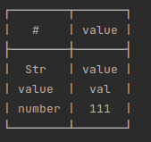
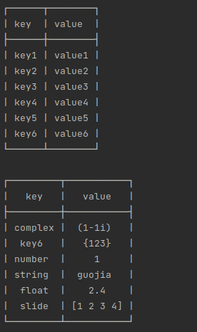
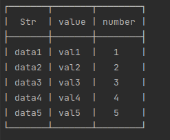
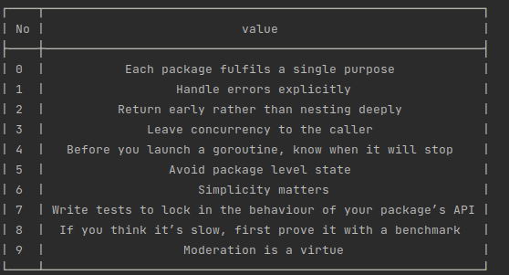
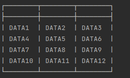

# go-tables 

- 0.0.1

### 1、关于GO-TABLES

> - Table Out 命令行表格输出工具
>
>   - 一个用于命令行输出美观的表格的库
>   - 支持不同的输入表格式
>   - 支持表头自定义
>   - 支持美化颜色、自定义格式颜色、时间序列化
>   - 支持自定义排序、分页、筛查
>
>   

### 2、快速使用

> ```bash
> go get -u -d github.com/guojia99/go-tables/table
> ```

- 目前支持以下五种数据结构输出

> ```
> Struct                  struct{}
> Map                     map[interface{}]interface{}
> StructSlice             []struct{}
> Slice                   []interface{}
> Slice2D                 [][]interface{}
> ```

你可以通过快速调用的方法，直接输出你原有的数据

```go
var opt = &table.Option{
    Contour: table.DefaultContour,
    Align:   table.AlignCenter,
}
tb, _ := table.SimpleTable(data, opt)
fmt.Println(tb)
```

- [Struct]: 	_example/struct-table.go "struct"

```go
type structTable struct {
	Str    string
	Val    string `table:"value"`
	Num    int    `json:"number"`
	NoUse  string `json:"-"`
	NoUse2 string `table:"-"`
}
data := structTable{
    Str:    "value",
    Val:    "val",
    Num:    111,
    NoUse:  "nouse",
    NoUse2: "nouse",
}

┌────────┬───────┐
|   #    | value |
├────────┼───────┤
|  Str   | value |
| value  |  val  |
| number |  111  |
└────────┴───────┘
```




- [Map]: 	_example/map-table.go

```go

data := map[string]string{
    "key1": "value1",
    "key2": "value2",
    "key3": "value3",
    "key4": "value4",
    "key5": "value5",
    "key6": "value6",
}

┌──────┬────────┐
| key  | value  |
├──────┼────────┤
| key1 | value1 |
| key2 | value2 |
| key3 | value3 |
| key4 | value4 |
| key5 | value5 |
| key6 | value6 |
└──────┴────────┘

data2 := map[string]interface{}{
    "number":  1,
    "string":  "guojia",
    "float":   2.4,
    "slide":   []int{1, 2, 3, 4},
    "complex": complex(1, -1),
    "key6": struct {
        a string
    }{a: "123"},
}

┌─────────┬───────────┐
|   key   |   value   |
├─────────┼───────────┤
| complex |  (1-1i)   |
|  key6   |   {123}   |
| number  |     1     |
| string  |  guojia   |
|  float  |    2.4    |
|  slide  | [1 2 3 4] |
└─────────┴───────────┘
```



- [StructSlice]: 	_example/structslice-table.go

```go
type structSliceTable struct {
	Str    string
	Val    string `table:"value"`
	Num    int    `json:"number"`
	NoUse  string `json:"-"`
	NoUse2 string `table:"-"`
}
data := []structSliceTable{
    {"data1", "val1", 1, "no1", "no2"},
    {"data2", "val2", 2, "no2", "no3"},
    {"data3", "val3", 3, "no3", "no4"},
    {"data4", "val4", 4, "no4", "no5"},
    {"data5", "val5", 5, "no5", "no6"},
}

┌───────┬───────┬────────┐
|  Str  | value | number |
├───────┼───────┼────────┤
| data1 | val1  |   1    |
| data2 | val2  |   2    |
| data3 | val3  |   3    |
| data4 | val4  |   4    |
| data5 | val5  |   5    |
└───────┴───────┴────────┘
```



- [Slice]: 	_example/slice-table.go

```go
data := []string{
	"Each package fulfils a single purpose",
	"Handle errors explicitly",
	"Return early rather than nesting deeply",
	"Leave concurrency to the caller",
	"Before you launch a goroutine, know when it will stop",
	"Avoid package level state",
	"Simplicity matters",
	"Write tests to lock in the behaviour of your package’s API",
	"If you think it’s slow, first prove it with a benchmark",
	"Moderation is a virtue",
}

┌────┬────────────────────────────────────────────────────────────┐
| No |                           value                            |
├────┼────────────────────────────────────────────────────────────┤
| 0  |           Each package fulfils a single purpose            |
| 1  |                  Handle errors explicitly                  |
| 2  |          Return early rather than nesting deeply           |
| 3  |              Leave concurrency to the caller               |
| 4  |   Before you launch a goroutine, know when it will stop    |
| 5  |                 Avoid package level state                  |
| 6  |                     Simplicity matters                     |
| 7  | Write tests to lock in the behaviour of your package’s API |
| 8  |  If you think it’s slow, first prove it with a benchmark   |
| 9  |                   Moderation is a virtue                   |
└────┴────────────────────────────────────────────────────────────┘
```



- [Slide2D]: 	_example/slice2d-table.go

```go
data := [][]string{
		{"DATA1", "DATA2", "DATA3"},
		{"DATA4", "DATA5", "DATA6"},
		{"DATA7", "DATA8", "DATA9"},
		{"DATA10", "DATA11", "DATA12"},
}

┌────────┬────────┬────────┐
├────────┼────────┼────────┤
| DATA1  | DATA2  | DATA3  |
| DATA4  | DATA5  | DATA6  |
| DATA7  | DATA8  | DATA9  |
| DATA10 | DATA11 | DATA12 |
└────────┴────────┴────────┘
你可以换掉table的空头部
```





### 3、表头与拓展列

- 默认表头
- 自定义表头
- 拓展列
- 合并单元格

### 4、序列化

- 颜色
- 自定义一个颜色序列化器
- 使用时间序列化器

