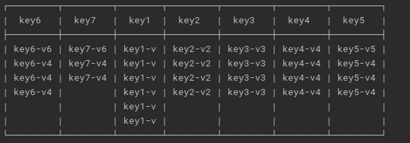

# go-tables 

### 1、about GO-TABLES

> - Table out command line table output tool
>
>   - A library for command line output of nice looking tables
>   - Supports different input table formats
>   - Support header customization
>   - Support beautification color, custom format color, time serialization [ development]
>   - Support custom sorting, paging, screening [development]
>

### 2、quick application

> ```bash
> go get -u -d github.com/guojia99/go-tables/table
> ```

- The following 6 types structures are currently supported for output

> ```
> Struct                  struct{}
> Map                     map[interface{}]interface{}
> MapSlice                []map[interface{}]interface{}
> StructSlice             []struct{}
> Slice                   []interface{}
> Slice2D                 [][]interface{}
> ```

You can directly output your original data by calling the method quickly

```go
var opt = &table.Option{
    Contour: table.DefaultContour,
    Align:   table.AlignCenter,
}
tb, _ := table.SimpleTable(data, opt)
fmt.Println(tb)
```

- ##### Struct to table

```go
type structTable struct {
	Str    string
	Val    string `table:"value"`
	Num    int    `json:"number"`
	NoUse  string `json:"-"`
	NoUse2 string `table:"-"`
}
data := structTable{
    Str:    "value",
    Val:    "val",
    Num:    111,
    NoUse:  "nouse",
    NoUse2: "nouse",
}
tb, _ := table.SimpleTable(data, opt)
fmt.Println(tb)

# out:
┌────────┬───────┐
|   #    | value |
├────────┼───────┤
|  Str   | value |
| value  |  val  |
| number |  111  |
└────────┴───────┘
```


- ##### Map to table

```go
data := map[string]string{
    "key1": "value1",
    "key2": "value2",
    "key3": "value3",
    "key4": "value4",
    "key5": "value5",
    "key6": "value6",
}
tb, _ := table.SimpleTable(data, opt)
fmt.Println(tb)

# out:
┌──────┬────────┐
| key  | value  |
├──────┼────────┤
| key1 | value1 |
| key2 | value2 |
| key3 | value3 |
| key4 | value4 |
| key5 | value5 |
| key6 | value6 |
└──────┴────────┘

data2 := map[string]interface{}{
    "number":  1,
    "string":  "guojia",
    "float":   2.4,
    "slide":   []int{1, 2, 3, 4},
    "complex": complex(1, -1),
    "key6": struct {
        a string
    }{a: "123"},
}
tb, _ := table.SimpleTable(data, opt)
fmt.Println(tb)

# out:
┌─────────┬───────────┐
|   key   |   value   |
├─────────┼───────────┤
| complex |  (1-1i)   |
|  key6   |   {123}   |
| number  |     1     |
| string  |  guojia   |
|  float  |    2.4    |
|  slide  | [1 2 3 4] |
└─────────┴───────────┘
```


- ##### map slice to table

```go
data := map[string][]string{
		"key1": {"key1-v", "key1-v", "key1-v", "key1-v", "key1-v", "key1-v"},
		"key2": {"key2-v2", "key2-v2", "key2-v2", "key2-v2"},
		"key3": {"key3-v3", "key3-v3", "key3-v3", "key3-v3"},
		"key4": {"key4-v4", "key4-v4", "key4-v4", "key4-v4"},
		"key5": {"key5-v5", "key5-v4", "key5-v4", "key5-v4"},
		"key6": {"key6-v6", "key6-v4", "key6-v4", "key6-v4"},
		"key7": {"key7-v6", "key7-v4", "key7-v4"},
}
tb, _ := table.SimpleTable(data, opt)
fmt.Println(tb)

# out put:
┌─────────┬─────────┬────────┬─────────┬─────────┬─────────┬─────────┐
|  key6   |  key7   |  key1  |  key2   |  key3   |  key4   |  key5   |
├─────────┼─────────┼────────┼─────────┼─────────┼─────────┼─────────┤
| key6-v6 | key7-v6 | key1-v | key2-v2 | key3-v3 | key4-v4 | key5-v5 |
| key6-v4 | key7-v4 | key1-v | key2-v2 | key3-v3 | key4-v4 | key5-v4 |
| key6-v4 | key7-v4 | key1-v | key2-v2 | key3-v3 | key4-v4 | key5-v4 |
| key6-v4 |         | key1-v | key2-v2 | key3-v3 | key4-v4 | key5-v4 |
|         |         | key1-v |         |         |         |         |
|         |         | key1-v |         |         |         |         |
└─────────┴─────────┴────────┴─────────┴─────────┴─────────┴─────────┘
```



- ##### Struct Slice to table

```go
type structSliceTable struct {
	Str    string
	Val    string `table:"value"`
	Num    int    `json:"number"`
	NoUse  string `json:"-"`
	NoUse2 string `table:"-"`
}
data := []structSliceTable{
    {"data1", "val1", 1, "no1", "no2"},
    {"data2", "val2", 2, "no2", "no3"},
    {"data3", "val3", 3, "no3", "no4"},
    {"data4", "val4", 4, "no4", "no5"},
    {"data5", "val5", 5, "no5", "no6"},
}
tb, _ := table.SimpleTable(data, opt)
fmt.Println(tb)

# out:
┌───────┬───────┬────────┐
|  Str  | value | number |
├───────┼───────┼────────┤
| data1 | val1  |   1    |
| data2 | val2  |   2    |
| data3 | val3  |   3    |
| data4 | val4  |   4    |
| data5 | val5  |   5    |
└───────┴───────┴────────┘
```


- ##### Slice to table

```go
data := []string{
	"Each package fulfils a single purpose",
	"Handle errors explicitly",
	"Return early rather than nesting deeply",
	"Leave concurrency to the caller",
	"Before you launch a goroutine, know when it will stop",
	"Avoid package level state",
	"Simplicity matters",
	"Write tests to lock in the behaviour of your package’s API",
	"If you think it’s slow, first prove it with a benchmark",
	"Moderation is a virtue",
}
tb, _ := table.SimpleTable(data, opt)
fmt.Println(tb)

# out:
┌────┬────────────────────────────────────────────────────────────┐
| No |                           value                            |
├────┼────────────────────────────────────────────────────────────┤
| 0  |           Each package fulfils a single purpose            |
| 1  |                  Handle errors explicitly                  |
| 2  |          Return early rather than nesting deeply           |
| 3  |              Leave concurrency to the caller               |
| 4  |   Before you launch a goroutine, know when it will stop    |
| 5  |                 Avoid package level state                  |
| 6  |                     Simplicity matters                     |
| 7  | Write tests to lock in the behaviour of your package’s API |
| 8  |  If you think it’s slow, first prove it with a benchmark   |
| 9  |                   Moderation is a virtue                   |
└────┴────────────────────────────────────────────────────────────┘
```


- ##### Slide2D to table

```go
data := [][]string{
		{"DATA1", "DATA2", "DATA3"},
		{"DATA4", "DATA5", "DATA6"},
		{"DATA7", "DATA8", "DATA9"},
		{"DATA10", "DATA11", "DATA12"},
}
tb, _ := table.SimpleTable(data, opt)
fmt.Println(tb)

# out:
┌────────┬────────┬────────┐
├────────┼────────┼────────┤
| DATA1  | DATA2  | DATA3  |
| DATA4  | DATA5  | DATA6  |
| DATA7  | DATA8  | DATA9  |
| DATA10 | DATA11 | DATA12 |
└────────┴────────┴────────┘
```


- ##### 


----

# development ...
